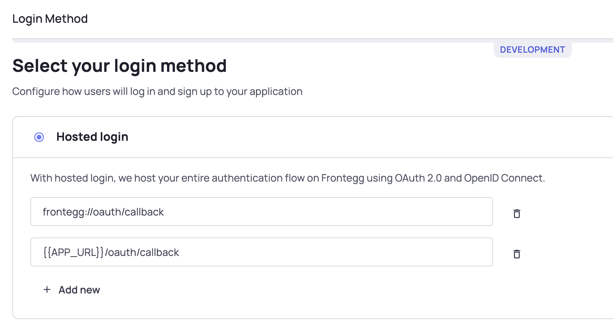
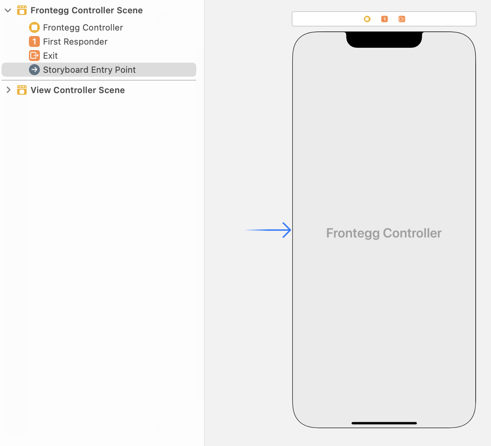

Frontegg is a web platform where SaaS companies can set up their fully managed, scalable and brand aware - SaaS features
and integrate them into their SaaS portals in up to 5 lines of code.

## Table of Contents

- [Project Requirements](#project-requirements)
  - [Supported Languages](#supported-languages)
  - [Supported Platforms](#supported-platforms)
- [Getting Started](#getting-started)
  - [Add frontegg package to the project](#add-frontegg-package-to-the-project)
  - [Prepare Frontegg workspace](#prepare-frontegg-workspace)
  - [Create Frontegg plist file](#create-frontegg-plist-file)
  - [SwiftUI Integration](#swiftui-integration)
    - [Add Frontegg Wrapper](#add-frontegg-wrapper)
    - [Add custom loading screen](#Add-custom-loading-screen)
  - [UIKit Integration](#uikit-integration)
    - [Add Frontegg UIKit Wrapper](#add-frontegg-uikit-wrapper)
    - [Add custom UIKit loading screen (coming-soon)](#Add-custom-uikit-loading-screen)
  - [Config iOS associated domain](#config-ios-associated-domain)

## Project Requirements

### Supported Languages

**Swift:** The minimum supported Swift version is now 5.3.

### Supported Platforms

Major platform versions are supported, starting from:

- iOS **14**

[//]: # (- macOS **12**)

[//]: # (- tvOS **14** )

[//]: # (- watchOS **7**)


## Getting Started

### Add frontegg package to the project

- Open you project
- Choose File -> Add Packages
- Enter `https://github.com/frontegg/frontegg-ios-swift` in search field
- Press `Add Package`

### Prepare Frontegg workspace

Navigate to [Frontegg Portal Settings](https://portal.frontegg.com/development/settings), If you don't have application
follow integration steps after signing up.


### Setup Hosted Login oauth callback

- Navigate to [Frontegg Login Methods](https://portal.frontegg.com/development/authentication/hosted),
- Add new redirect url `frontegg://oauth/callback`
   


### Create Frontegg plist file

To setup your SwiftUI application to communicate with Frontegg, you have to create a new file named `Frontegg.plist` under
your root project directory, this file will store values to be used variables by Frontegg SDK: 

```xml
<?xml version="1.0" encoding="UTF-8"?>
<!DOCTYPE plist PUBLIC "-//Apple//DTD PLIST 1.0//EN" "http://www.apple.com/DTDs/PropertyList-1.0.dtd">
<plist version="1.0">
<dict>
	<key>baseUrl</key>
	<string>https://[DOMAIN_HOST_FROM_PREVIOUS_STEP]</string>
	<key>clientId</key>
	<string>[CLIENT_ID_FROM_PREVIOUS_STEP]</string>
</dict>
</plist>
```

### SwiftUI integration

- ### Add Frontegg Wrapper

  - To use Frontegg SDK you have to wrap you Application Scene with FronteggWrapper
      ```swift
    
      import SwiftUI
      import FronteggSwift
    
      @main
      struct demoApp: App {
          var body: some Scene {
              WindowGroup {
                  FronteggWrapper {
                      MyApp()
                  }
              }
          }
      }
      ```
  - Modify `MyApp.swift` file to render content if user is authenticated:
    1. Add `@EnvironmentObject var fronteggAuth: FronteggAuth` to
    2. Render your entire application based on `fronteggAuth.isAuthenticated`
  
    ```swift
    struct MyApp: View {
      @EnvironmentObject var fronteggAuth: FronteggAuth
      
      var body: some View {
        ZStack {
          if fronteggAuth.isAuthenticated {
            [YOU APPLICATION TABS / ROUTER / VIEWS]
          } else  {
            FronteggLoginPage()
          }
        }
      }
    }
    ```

  - ### Add custom loading screen

  To use your own `LoadingView` / `SplashScreen`:
  
  - Build your loading view in separated file
  - Pass `LoadingView` as AnyView to the FronteggWrapper
    ```swift
    FronteggWrapper(loaderView: AnyView(LoaderView())) {
      MyApp()
    }
    ```


### UIKit integration

- ### Add Frontegg UIKit Wrapper
  - Add Frontegg to the AppDelegate file
    ```swift
      func application(_ application: UIApplication, didFinishLaunchingWithOptions launchOptions: [UIApplication.LaunchOptionsKey: Any]?) -> Bool {
          // Override point for customization after application launch.
    
          FronteggApp.shared.didFinishLaunchingWithOptions()
        
          return true
      }
    ```
  - Create FronteggController class that extends AbstractFronteggController from FronteggSwift
    ```swift 
      //
      //  FronteggController.swift
      //
      
      import UIKit
      import FronteggSwift
      
      class FronteggController: AbstractFronteggController {
      
          override func navigateToAuthenticated(){
              // This function will be called when the user is authenticated
              // to navigate your application to the authenticated screen
              
              let mainStoryboard: UIStoryboard = UIStoryboard(name: "Main", bundle: nil)
              let viewController = mainStoryboard.instantiateViewController(withIdentifier: "authenticatedScreen")
              self.view.window?.rootViewController = viewController
              self.view.window?.makeKeyAndVisible()
          }
      
      }
    ```
  - Create new ViewController and set FronteggController as view custom class from the previous step
    
    
  - Mark FronteggController as **Storyboard Entry Point**
    
  
  - Setup SceneDelegate for Frontegg universal links:
      ```swift
        func scene(_ scene: UIScene, openURLContexts URLContexts: Set<UIOpenURLContext>) {
            if let url = URLContexts.first?.url,
                url.startAccessingSecurityScopedResource() {
                defer  {
                    url.stopAccessingSecurityScopedResource()
                }
                if url.absoluteString.hasPrefix( FronteggApp.shared.baseUrl ) {
                    FronteggApp.shared.auth.pendingAppLink = url
                    window?.rootViewController = FronteggController()
                    window?.makeKeyAndVisible()
                }
                
            }
        }
        func scene(_ scene: UIScene, continue userActivity: NSUserActivity) {
            if let url = userActivity.webpageURL,
               url.absoluteString.hasPrefix( FronteggApp.shared.baseUrl ){
                FronteggApp.shared.auth.pendingAppLink = url
                window?.rootViewController = FronteggController()
                window?.makeKeyAndVisible()
            }
        }
      ```
  - Access authenticated user by `FronteggApp.shared.auth`
      ```swift
          
        //
        //  ExampleViewController.swift
        //
        
        import UIKit
        import SwiftUI
        import FronteggSwift
        import Combine
        
        
        class ExampleViewController: UIViewController {
        
            // Label to display logged in user's email
            @IBOutlet weak var label: UILabel!
            
            override func viewDidLoad() {
                super.viewDidLoad()
                // Do any additional setup after loading the view.
                
                // subscribe to isAuthenticated and navigate to login page
                // if the user is not authenticated
    
                let sub = AnySubscriber<Bool, Never>(
                    receiveSubscription: {query in
                        query.request(.unlimited)
                    }, receiveValue: { isAuthenticated in
                        if(!isAuthenticated){
                            self.view.window?.rootViewController = FronteggController()
                            self.view.window?.makeKeyAndVisible()
                            return .none
                        }
                        return .unlimited
                        })
                FronteggApp.shared.auth.$isAuthenticated.subscribe(sub)
        
                label.text = FronteggApp.shared.auth.user?.email ?? "Unknown"
            }
             
            @IBAction func logoutButton (){
                FronteggApp.shared.auth.logout()
            }

        }
        
      ```
  


### Config iOS associated domain

Contact Frontegg Support for adding iOS associated domain to your Frontegg application,
This config is necessary for Magic Link authenticated / Reset Password / Activate Accounts
